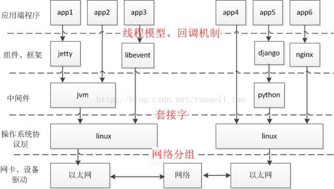
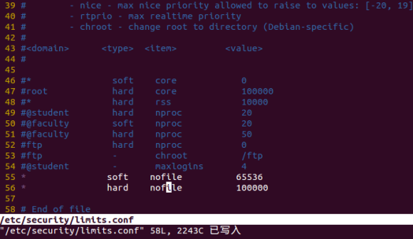

# 高并发服务器

{width="5.863226159230096in" height="3.31200021872266in"}

## 多进程并发服务器

使用多进程并发服务器时要考虑以下几点：

1.  父进程最大**文件描述个数**(父进程中需要close关闭accept返回的新文件描述符)

2.  系统内创建**进程个数**(与内存大小相关)

3.  进程创建过多是否降低整体服务性能(进程调度)

### server

/\* server.c \*/

### client

/\* client.c \*/

## 多线程并发服务器

在使用线程模型开发服务器时需考虑以下问题：

1.  调整进程内最大**文件描述符上限**

2.  线程如有共享数据，考虑**线程同步**

3.  服务于客户端线程退出时，**退出处理**。（退出值，分离态）

4.  系统负载，随着链接客户端增加，导致其它线程不能及时得到CPU

### server

/\* server.c \*/

### client

/\* client.c \*/

## 多路I/O转接服务器

多路IO转接服务器也叫做多任务IO服务器。该类服务器实现的**主旨思想**是，**不再由应用程序自己监视客户端连接，取而代之由内核替应用程序监视文件。**

主要使用的方法有三种

### select

1.  select能**监听的文件描述符个数受限**于FD\_SETSIZE,一般为1024，单纯改变进程打开的文件描述符个数并不能改变select监听文件个数

2.  解决1024以下客户端时使用select是很合适的，但如果链接客户端过多，select采用的是**轮询**模型，会大大降低服务器响应效率，不应在select上投入更多精力

> \#include &lt;sys/select.h&gt;
> /\* According to earlier standards \*/
> \#include &lt;sys/time.h&gt;
> \#include &lt;sys/types.h&gt;
> \#include &lt;unistd.h&gt;
> int select(int nfds, fd\_set \*readfds, fd\_set \*writefds,fd\_set \*exceptfds, struct timeval \*timeout);
>

nfds: 监控的文件描述符集里最大文件描述符加1，因为此参数会告诉内核检测前多少个文件描述符的状态
readfds： 监控有**读**数据到达文件描述符集合，传入传出参数
writefds： 监控有**写**数据到达文件描述符集合，传入传出参数
exceptfds： 监控异常发生达文件描述符集合，如带外数据到达异常，传入传出参数
timeout： 定时阻塞监控时间，3种情况
	1.NULL，永远等下去
	2.设置timeval，等待固定时间
	3.设置timeval里时间均为0，检查描述字后立即返回，轮询

​        struct timeval {
        long tv\_sec; /\* seconds \*/
        long tv\_usec; /\* microseconds \*/
        };

**文件描述符集合操作**
void FD\_CLR(int fd, fd\_set \*set); //把文件描述符集合里fd清0
int FD\_ISSET(int fd, fd\_set \*set); //测试文件描述符集合里fd是否置1
void FD\_SET(int fd, fd\_set \*set); //把文件描述符集合里fd位置1
void FD\_ZERO(fd\_set \*set); //把文件描述符集合里所有位清0

#### server

/\* server.c \*/

#### client

/\* client.c \*/

#### pselect

pselect原型如下。此模型应用较少，有需要的同学可参考select模型自行编写C/S

> \#include &lt;sys/select.h&gt;
> int pselect(int nfds, fd\_set \*readfds, fd\_set \*writefds,fd\_set \*exceptfds, const struct timespec \*timeout,const sigset\_t \*sigmask);

> struct timespec {
> long tv\_sec; /\* seconds \*/
> long tv\_nsec; /\* nanoseconds \*/
> };

用sigmask替代当前进程的阻塞信号集，调用返回后还原原有阻塞信号集

### poll

> \#include &lt;poll.h&gt;
> int poll(struct pollfd \*fds, nfds\_t nfds, int timeout);

struct pollfd {
int fd; /\* 文件描述符 \*/
short events; /\* 监控的事件 \*/
short revents; /\* 监控事件中满足条件返回的事件 \*/
};
**POLLIN** 普通或带外优先数据可读,即POLLRDNORM | POLLRDBAND
POLLRDNORM 数据可读
POLLRDBAND 优先级带数据可读
POLLPRI 高优先级可读数据
**POLLOUT** 普通或带外数据可写
POLLWRNORM 数据可写
POLLWRBAND 优先级带数据可写
**POLLERR** 发生错误
POLLHUP 发生挂起
POLLNVAL 描述字不是一个打开的文件

nfds 监控数组中有多少文件描述符需要被监控

timeout 毫秒级等待
	-1：阻塞等，\#define INFTIM -1 Linux中没有定义此宏
	0：立即返回，不阻塞进程
	>0：等待指定毫秒数，如当前系统时间精度不够毫秒，向上取值

如果不再监控某个文件描述符时，可以把pollfd中，fd设置为-1，poll不再监控此pollfd，下次返回时，把revents设置为0。

#### server

/\* server.c \*/

#### client

/\* client.c \*/

#### ppoll

GNU定义了ppoll（非POSIX标准），可以支持设置信号屏蔽字，大家可参考poll模型自行实现C/S。

> \#define \_GNU\_SOURCE /\* See feature\_test\_macros(7) \*/
> \#include &lt;poll.h&gt;
> int ppoll(struct pollfd \*fds, nfds\_t nfds,const struct timespec \*timeout\_ts, const sigset\_t \*sigmask);
>

### epoll

epoll是Linux下**多路复用IO接口select/poll的增强版本**，它能显著**提高**程序在**大量并发连接**中只有**少量活跃**的情况下的系统**CPU利用率**，因为它会复用文件描述符集合来传递结果而不用迫使开发者每次等待事件之前都必须重新准备要被侦听的文件描述符集合，另一点原因就是获取事件的时候，它**无须遍历整个被侦听的描述符集**，只要遍历那些被内核IO事件异步唤醒而加入Ready队列的描述符集合就行了。

目前epell是linux大规模并发网络程序中的热门首选模型。

epoll除了提供select/poll那种IO事件的电平触发（Level Triggered）外，还提供了**边沿触发**（Edge Triggered），这就使得用户空间程序有可能缓存IO状态，减少epoll\_wait/epoll\_pwait的调用，提高应用程序效率。

可以使用cat命令查看一个进程可以打开的**socket描述符上限**。

```
cat /proc/sys/fs/file-max
801558
```

如有需要，可以通过修改配置文件的方式修改该上限值。

```
sudo vi /etc/security/limits.conf
```

在文件尾部写入以下配置,soft软限制，hard硬限制。如下图所示。

\* soft nofile 65536
\* hard nofile 100000

{width="5.456000656167979in" height="3.1662182852143483in"}

#### 基础API

1.  创建一个epoll句柄，参数size用来告诉内核监听的文件描述符的个数，跟内存大小有关。

> \#include &lt;sys/epoll.h&gt;
> int epoll\_create(int size) 			// size：监听数目

2. 控制某个epoll监控的文件描述符上的事件：注册、修改、删除。

> \#include &lt;sys/epoll.h&gt;
> int epoll\_ctl(int epfd, int op, int fd, struct epoll\_event \*event)

epfd： 为epoll\_creat的句柄

op： 表示动作，用3个宏来表示：
EPOLL\_CTL\_ADD (注册新的fd到epfd)，
EPOLL\_CTL\_MOD (修改已经注册的fd的监听事件)，
EPOLL\_CTL\_DEL (从epfd删除一个fd)；

event： 告诉内核需要监听的事件
struct epoll\_event {
\_\_uint32\_t events; /\* Epoll events \*/
epoll\_data\_t data; /\* User data variable \*/
};
typedef union epoll\_data {
void \*ptr;
int fd;
uint32\_t u32;
uint64\_t u64;
} epoll\_data\_t;
**EPOLLIN** ： 表示对应的文件描述符可以读（包括对端SOCKET正常关闭）
**EPOLLOUT**： 表示对应的文件描述符可以写
EPOLLPRI： 表示对应的文件描述符有紧急的数据可读（这里应该表示有带外数据到来）
**EPOLLERR**： 表示对应的文件描述符发生错误
EPOLLHUP： 表示对应的文件描述符被挂断；
EPOLLET： 将EPOLL设为边缘触发(Edge Triggered)模式，这是相对于水平触发(Level Triggered)而言的
EPOLLONESHOT：只监听一次事件，当监听完这次事件之后，如果还需要继续监听这个socket的话，需要再次把这个socket加入到EPOLL队列里

3. 等待所监控文件描述符上有事件的产生，类似于select()调用。

> \#include &lt;sys/epoll.h&gt;
> int epoll\_wait(int epfd, struct epoll\_event \*events, int maxevents, int timeout)
> 成功：返回有多少文件描述符就绪，
> 时间到时返回0，
> 出错返回-1

events： 用来存内核得到事件的集合，

maxevents： 告之内核这个events有多大，这个maxevents的值不能大于创建epoll\_create()时的size，

timeout： 是超时时间
    -1： 阻塞
    0： 立即返回，非阻塞
    &gt;0： 指定毫秒


#### server

/* server.c */

#### client

/\* client.c \*/

## epoll进阶

### 事件触发模型

EPOLL事件有两种模型：

**边缘触发**(**ET**)Edge Triggered  只**有数据到来**才触发，不管缓存区中是否还有数据。

**水平触发**(**LT**)Level Triggered  只要**有数据**都会触发。

思考如下步骤：

1.  假定我们已经把一个用来从管道中读取数据的文件描述符(RFD)添加到epoll描述符。

2.  管道的另一端写入了2KB的数据

3.  调用epoll\_wait，并且它会返回RFD，说明它已经准备好读取操作

4.  读取1KB的数据

5.  调用epoll\_wait……

在这个过程中，有两种工作模式：

#### ET模式

ET模式即Edge Triggered工作模式。

如果我们在第1步将RFD添加到epoll描述符的时候使用了EPOLLET标志，那么在第5步调用epoll\_wait之后将有可能会挂起，因为剩余的数据还存在于文件的输入缓冲区内，而且数据发出端还在等待一个针对已经发出数据的反馈信息。只有在监视的文件句柄上发生了某个事件的时候 ET 工作模式才会汇报事件。因此在第5步的时候，调用者可能会放弃等待仍在存在于文件输入缓冲区内的剩余数据。epoll工作在ET模式的时候，必须使用**no-block**非阻塞套接口，以避免由于一个文件句柄的阻塞读/阻塞写操作把处理多个文件描述符的任务饿死。最好以下面的方式调用ET模式的epoll接口，在后面会介绍避免可能的缺陷。

1)  基于**no-block**非阻塞文件句柄

2)  只有当read或者write返回EAGAIN(非阻塞读，暂时无数据)时才需要挂起、等待。但这并不是说每次read时都需要循环读，直到读到产生一个EAGAIN才认为此次事件处理完成，当read返回的读到的数据长度小于请求的数据长度时，就可以确定此时缓冲中已没有数据了，也就可以认为此事读事件已处理完成。

#### LT模式（默认）

LT模式即Level Triggered工作模式。

与ET模式不同的是，以LT方式调用epoll接口的时候，它就相当于一个速度比较快的poll，无论后面的数据是否被使用。

LT(level triggered)：LT是**缺省**的工作方式，并且同时支持**block**和**no-block** socket。在这种做法中，内核告诉你一个文件描述符是否就绪了，然后你可以对这个就绪的fd进行IO操作。如果你不作任何操作，内核还是会继续通知你的，所以，这种模式编程出错误可能性要小一点。传统的select/poll都是这种模型的代表。

ET(edge-triggered)：ET是**高速**工作方式，只支持**no-block** socket。在这种模式下，当描述符从未就绪变为就绪时，内核通过epoll告诉你。然后它会假设你知道文件描述符已经就绪，并且不会再为那个文件描述符发送更多的就绪通知。请注意，如果一直不对这个fd作IO操作(从而导致它再次变成未就绪)，内核不会发送更多的通知(only once).

### 实例一：

基于管道epoll LT/ET触发模式

### 实例二：

基于网络C/S模型的epoll ET触发模式

#### server

/\* server.c \*/

#### client

/\* client.c \*/

### 实例三：

基于网络C/S非阻塞模型的epoll ET触发模式

#### server

/\* server.c \*/

#### client

/\* client.c \*/

## 线程池并发处理服务器

1.  预先创建阻塞于accept多线程，使用互斥锁上锁保护accept

2.  预先创建多线程，由主线程调用accept


