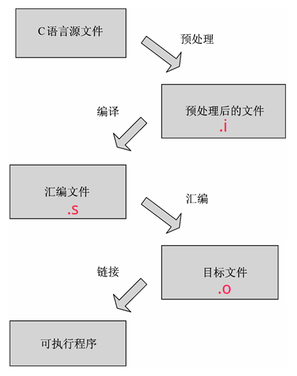

# C++笔记


### CLion

> Ctrl + / 添加或删除注释
> Ctrl + Alt + L 格式化代码
> Alt + Enter 智能提示
> Ctrl + R 替换
> Ctrl + Shift + R 全局替换
> Ctrl + F 搜索
> Ctrl + Shift + F 全局搜索
> Ctrl + B 在定义和申明之间跳转
> Ctrl + Shift + Backspace 回到最后编辑的地方
> Alt + 鼠标选择  多行编辑
> Shift + Enter 在下面新开一行
> Ctrl + Alt + -/+ 展开折叠当前函数、类
> Ctrl + Shift + -/+ 展开折叠所有函数、类Ctrl + N 查找类
> Ctrl + Q 快速查看文档
> Ctrl + P 提示参数信息
> Ctrl + H 查看继承树
> Ctrl + Shift + N 找文件
> Shift + Shift 全局搜索

在keymap快捷键找到 related symbol :  .h 和.CPPcpp切换


### VS Code

ctrl+shift+n   打开新窗口


### gcc

#### gcc简介

GNU编译器套装（英语：GNU Compiler Collection，缩写为GCC），指一套编程语言编译器，以GPL及LGPL许可证所发行的自由软件，也是GNU计划的关键部分，也是GNU工具链的主要组成部分之一。GCC（特别是其中的C语言编译器）也常被认为是跨平台编译器的事实标准。

GCC编译器是 Linux 下默认的 C/C++ 编译器，大部分 Linux 发行版中都是默认安装的。

GNU(GNU's Not Unix)是一个自由的操作系统

GPL,General Public License 通用公共授权书

**gcc的特点**

- gcc是一个可移植的编译器，支持多种硬件平台。例如ARM、X86等等。
- gcc不仅是个本地编译器，它还能跨平台交叉编译。所谓的本地编译器，是指编译出来的程序只能够在本地环境进行运行。而gcc编译出来的程序能够在其他平台进行运行。例如嵌入式程序可在x86上编译，然后在arm上运行。
- gcc有多种语言前端，用于解析不同的语言。
- gcc是按模块化设计的，可以加入新语言和新CPU架构的支持。
- gcc是自由软件。任何人都可以使用或更改这个软件。

查看gcc版本号

```
gcc -v 
gcc --version
```

#### gcc 编译流程

gcc编译程序主要经过四个过程：

- 预处理（Pre-Processing）
- 编译 （Compiling）
- 汇编 （Assembling）
- 链接 （Linking）




预处理实际上是将头文件、宏进行展开。编译阶段，gcc调用不同语言的编译器，例如c语言调用编译器ccl。gcc实际上是个工具链，在编译程序的过程中调用不同的工具。汇编阶段，gcc调用汇编器进行汇编。链接过程会将程序所需要的目标文件进行链接成可执行文件。汇编器生成的是可重定位的目标文件，学过操作系统，我们知道，在源程序中地址是从0开始的，这是一个相对地址，而程序真正在内存中运行时的地址肯定不是从0开始的，而且在编写源代码的时候也不能知道程序的绝对地址，所以重定位能够将源代码的代码、变量等定位为内存具体地址。下面以一张图来表示这个过程，注意过程中文件的后缀变化，编译选项和这些后缀有关。

GCC 既可以一次性完成C语言源文件的编译，也可以分步骤完成。

`.i`预处理文件、编译`.s`汇编文件、`.o`目标文件可以认为是中间文件或临时文件，如果使用 GCC 一次性完成C语言程序的编译，那么只能看到最终的可执行文件，这些中间文件都是看不到的，因为 GCC 已经经它们删除了。

```
gcc -c main.c    # 编译# 将.c源文件编译成目标文件.o
gcc main.o    # 链接# 将.o 链接成为可执行文件
```

```
gcc -E hello.c -o hello.i   对hello.c文件进行预处理，生成了hello.i 文件
gcc -S hello.i -o hello.s    对预处理文件进行编译，生成了汇编文件
gcc -c hello.s -o hello.o  对汇编文件进行编译，生成了目标文件
gcc hello.o -o hello 对目标文件进行链接，生成可执行文件
gcc hello.c -o hello 直接编译链接成可执行目标文件
gcc -c hello.c 或 gcc -c hello.c -o hello.o 编译生成可重定位目标文件
```

`-E` 预处理指定的源文件，不进行编译，生成**预处理**文件`.i`

`-S` 将C语言源文件编译为汇编语言，但并不汇编该程序，生成**汇编**文件`.s`

`-c` 只编译、汇编源文件，但不链接，生成obj**目标**文件`.o`

`-o` 指定输出文件

`-g` 包含调试信息

`-I +目录` 指定头文件目录

`-Wall` 提示更多警告信息

`-l` 添加标准库中链接库

`-L` 添加搜索链接库的目录

`-D` 编译时定义宏
`-On` 编译优化
		-O0 - 没有优化
		-O1 - 缺省值
		-O3 - 优化级别最高

`-std=c99`

`-std=c11`

#### 使用外部库

在使用C语言和其他语言进行程序设计的时候，我们需要头文件来提供对常数的定义和对系统及库函数调用的声明。库文件是一些预先编译好的函数集合，那些函数都是按照可重用原则编写的。它们通常由一组互相关联的可重用原则编写的，它们通常由一组互相关联的用来完成某项常见工作的函数构成。使用库的优点在于：

- 模块化的开发
- 可重用性
- 可维护性

库又可以分为静态库与动态库：

- 静态库（.a）：程序在编译链接的时候把库的代码链接到可执行文件中。程序运行的时候将不再需要静态库。静态库比较占用磁盘空间，而且程序不可以共享静态库。运行时也是比较占内存的，因为每个程序都包含了一份静态库。
- 动态库（.so或.sa）：程序在运行的时候才去链接共享库的代码，多个程序共享使用库的代码，这样就减少了程序的体积。

一般头文件或库文件的位置在：

- /usr/include及其子目录底下的include文件夹
- /usr/local/include及其子目录底下的include文件夹
- /usr/lib
- /usr/local/lib
- /lib

静态库链接时搜索路径顺序：

1. ld会去找GCC命令中的参数-L
2. 再找gcc的环境变量LIBRARY_PATH
3. 再找内定目录 /lib /usr/lib /usr/local/lib 这是当初compile gcc时写在程序内的

动态链接时、执行时搜索路径顺序:

1. 编译目标代码时指定的动态库搜索路径
2. 环境变量LD_LIBRARY_PATH指定的动态库搜索路径
3. 配置文件/etc/ld.so.conf中指定的动态库搜索路径
4. 默认的动态库搜索路径/lib
5. 默认的动态库搜索路径/usr/lib

有关环境变量：
`LIBRARY_PATH`环境变量：指定程序**静态链接库**文件搜索路径
`LD_LIBRARY_PATH`环境变量：指定程序**动态链接库**文件搜索路径

#### gcc生成静态链接库

```
gcc -c hello.c -o hello.o    # 生成目标文件.o
ar -r libhello.a hello.o    # hello.o打包成静态库libhello.a
```

( 静态库名称规则： **libxxx.a**, 否则在使用-l链接的时候会找不到）

ar是gun归档工具，rcs表示replace and create，如果libhello之前存在，将创建新的libhello.a并将其替换。

#### gcc链接静态库

使用静态库libhello.a

```
gcc main.c libhello.a -o main    # 直接链接静态库全名
#  或者：
gcc -L ./ main.c -lhello -o main    # -l链接静态库
```

-L制定库的搜索路径，-l调用链接库


#### gcc生成动态链接库

如果想创建一个动态链接库，可以使用 GCC 的`-shared`选项。输入文件可以是源文件、汇编文件或者目标文件。

另外还得结合`-fPIC`选项。-fPIC 选项作用于编译阶段，告诉编译器产生与位置无关代码（Position-Independent Code）；这样一来，产生的代码中就没有绝对地址了，全部使用相对地址，所以代码可以被加载器加载到内存的任意位置，都可以正确的执行。这正是共享库所要求的，共享库被加载时，在内存的位置不是固定的。

从源文件生成动态链接库：

```
gcc -fPIC -shared func.c -o libhello.so
```

动态链接库，名称的规则是**libxxx.so**

从目标文件生成动态链接库：

```
gcc -fPIC -c func.c -o func.o
gcc -shared func.o -o libhello.so
```

-fPIC 选项作用于编译阶段，在生成目标文件时就得使用该选项，以生成位置无关的代码。

#### gcc链接动态链接库

如果希望将一个动态链接库链接到可执行文件，那么需要在命令行中列出动态链接库的名称，具体方式和普通的源文件、目标文件一样。

```
gcc main.c libhello.so -o main    # 直接链接动态库全名
# 或者
gcc main.c -o main -L ./ -lhello    # -l链接静态库
```

-L制定库的搜索路径，-l调用链接库

将 main.c 和 libhello.so 一起编译成 main，当 main运行时，会动态地加载链接库 libfunc.so。

当然，必须要确保程序在运行时可以找到这个动态链接库。你可以将链接库放到标准目录下，例如 /usr/lib，或者设置一个合适的环境变量，例如 LIBRARY_PATH。不同系统，具有不同的加载链接库的方法。

共享库有时候并不不在当前的目录下，为了让gcc能够找得到共享库，有下面几种方法：

1. 拷贝.so文件到系统共享库路径下，一般指/usr/lib
2. 在~/.bash_profile文件中，配置LD_LIBRARY_PATH变量
3. 配置/etc/ld.so.conf，配置完成后调用ldconfig更新ld.so.cache

其中，shared选项表示生成共享库格式。fPIC表示产生位置无关码（position independent code），位置无关码表示它的运行、加载与内存位置无关，可以在任何内存地址进行加载。

### CMake编译

[cmake官方教程](https://cmake.org/cmake-tutorial/)

[cmake官方帮助手册](https://cmake.org/cmake/help/latest/)

[cmake使用教程](https://juejin.im/post/5a6f32e86fb9a01ca6031230)

CMake是一种跨平台编译工具，是一个集软件构建、测试、打包于一身的软件，比make更为高级。它可以根据不同平台、不同的编译器，生成相应的Makefile。CMake主要是编写CMakeLists.txt文件，然后用cmake命令将CMakeLists.txt文件转化为make所需要的makefile文件，最后用make命令编译源码生成可执行程序或共享库（so(shared object)）。

cmake  指向CMakeLists.txt所在的目录，例如cmake .. 表示CMakeLists.txt在当前目录的上一级目录。cmake后会生成很多编译的中间文件以及makefile文件，所以一般建议新建一个新的目录，专门用来编译。

CMake自动生成的Makefile不仅可以通过make命令构建项目生成目标文件，还支持安装（make install）、测试安装的程序是否能正确执行（make test，或者ctest）、生成当前平台的安装包（make package）、生成源码包（make package_source）、产生Dashboard显示数据并上传等高级功能，只要在CMakeLists.txt中简单配置，就可以完成很多复杂的功能，包括写测试用例。

make根据生成makefile文件，编译程序。

> 在 linux 平台下使用 CMake 生成 Makefile 并编译的流程如下：
>
> 1. 编写 cmake 配置文件 **CMakeLists.txt** 
>
> 2. 执行命令 `cmake PATH` 或者 `ccmake PATH` 生成 **Makefile** ,其中，`PATH` 是 CMakeLists.txt 所在的目录。
>
> 3. 使用 `make` 命令进行编译。
>
>    `ccmake` 和 `cmake` 的区别在于ccmake提供了一个交互式的界面。

```
mkdir build
cd build
cmake ..    # 指向CMakeLists.txt所在的目录,生成的makefile文件
# 编译
make    # 编译,指向makefile文件,生成执行程序
# 安装
make install  
# 测试安装的程序是否能正确执行
make test
# 将程序和相关的档案包装成一个压缩文件以供发布
make dist
# 生成当前平台的安装包
make package  
# 生成源码包
make package_source  
# 清除编译产生的可执行文件及目标文件(object file，*.o)
make clean
```

CMakeLists.txt 的语法比较简单，由命令、注释和空格组成，其中命令是不区分大小写的。符号 # 后面的内容被认为是注释。命令由命令名称、小括号和参数组成，参数之间使用空格进行间隔。

#### CMakeLists.txt文件格式

1. #设置最低版本的cmake要求
   cmake_minimum_required(VERSION 2.8)

2. #设置项目信息，一般和项目的文件夹名称对应
   project(demo_main_project)

3. #设置编译器版本
   set(CMAKE_CXX_STANDARD 14)

4. #添加头文件
     include_directories(./include)  # 把当前目录(CMakeLists.txt所在目录)下的include文件夹加入到包含路径
     include_directories(
       ${CMAKE_CURRENT_SOURCE_DIR}
       ${CMAKE_CURRENT_BINARY_DIR}
       ${CMAKE_CURRENT_LIST_DIR}/include)

5. #添加源文件
     5.2 搜索指定目录下的所有的 cpp 文件,并将结果存储在指定变量名中
     aux_source_directory(<dir> <variable>)  # 查找dir路径下的所有源文件(不会递归包含子目录)，保存到variable变量中

     ​    aux_source_directory(./src SRC_DIR)   # 搜索**./src目录**下的所有的.cpp源文件,并将结果存在**变量 SRC_DIR**中
     ​    add_executable(demo_main ${SRC_DIR})  # 给demo添加包含的源文件   

     也可以这样 add_library(demo_main ${SRC_DIR})  # 给demo添加包含的源文件

     #注意${SRC_DIR}变量**定义**一定要在**使用前**，否则会报错`No SOURCES given to target: `

       5.1 添加包含的所有源文件(数量少)
       add_library(demo demo.cpp test.cpp util.cpp)  # 给demo添加包含的源文件

6. #添加链接库文件搜索目录
    link_directories(directory1 directory2 ...)  # 添加了库包含路径directory1 directory2 ...
    link_directories( ${CMAKE_CURRENT_LIST_DIR}/lib )  # 添加./lib下的链接库

7. #设置编译类型,主函数生成可执行文件
    add_executable(demo_main demo_main.cpp)     # 生成可执行文件

8. #添加可执行文件 target 需要链接的库文件,等效与g++ -l库文件名
    target_link_libraries(<name> lib1 lib2 lib3)  # 将lib1, lib2, lib3链接到<name>上
    target_link_libraries(demo_main util)  
    #字叫demo_main这个target需要链接util这个库，会优先搜索libutil.a， 如果没有就搜索libutil.so
     8.1 #指定链接动态库或静态库
      target_link_libraries(demo libface.a) # 链接libface.a
      target_link_libraries(demo libface.so) # 链接libface.so
      8.2 #指定全路径
      target_link_libraries(demo ${CMAKE_CURRENT_SOURCE_DIR}/lib/)
      8.3 #指定链接多个库
      target_link_libraries(demo
         ${CMAKE_CURRENT_SOURCE_DIR}/libs/libface.a
         boost_system.a
         boost_thread
         pthread)

   

#查找指定的库文件？？
find_package(OpenCV 2.4.3 REQUIRED)
  find_library()
  类似的命令还有 find_file()、find_path()、find_program()、find_package()。

3.add_library 添加库？？
3.1 添加一个库

```
add_library(<name> [STATIC | SHARED | MODULE] [EXCLUDE_FROM_ALL] source1 source2 ... sourceN)
```

添加一个名为<name>的库文件
指定STATIC, SHARED, MODULE参数来指定要创建的库的类型, 
STATIC对应的静态库 .a
SHARED对应共享动态库.so
[EXCLUDE_FROM_ALL], 如果指定了这一属性，对应的一些属性会在目标被创建时被设置(指明此目录和子目录中所有的目标，是否应当从默认构建中排除, 子目录的IDE工程文件/Makefile将从顶级IDE工程文件/Makefile中排除)
source1 source2 ... sourceN用来指定源文件
3.2 导入已有的库
add_library(<name> [STATIC | SHARED | MODULE | UNKNOWN] IMPORTED)
导入了一个已存在的<name>库文件，导入库一般配合set_target_properties使用，这个命令用来指定导入库的路径,比如：

> add_library(test SHARED IMPORTED)
> set_target_properties(  test #指定目标库名称
>                         PROPERTIES IMPORTED_LOCATION #指明要设置的参数
>                         libs/src/${ANDROID_ABI}/libtest.so #设定导入库的路径)

add_library(common STATIC util.cpp)     # 生成静态库 .a
add_library(common SHARED util.cpp)     # 生成动态共享库 .so

9. add_subdirectory 如果当前目录下还有子目录时可以使用add_subdirectory，子目录中也需要包含有CMakeLists.txt

9. file文件操作命令

三、常用变量

1. 预定义变量
   PROJECT_NAME：项目名称
   PROJECT_SOURCE_DIR：工程的根目录
   CMAKE_CURRENT_LIST_DIR：CMakeLists.txt 的完整路径
   CMAKE_CURRENT_SOURCE_DIR：当前处理的 CMakeLists.txt 所在的路径
   PROJECT_BINARY_DIR：运行 cmake 命令的目录，通常是 ${PROJECT_SOURCE_DIR}/build
   CMAKE_CURRENT_BINARY_DIR：target 编译目录
   CMAKE_CURRENT_LIST_LINE：当前所在的行
   CMAKE_MODULE_PATH：定义自己的 cmake 模块所在的路径，SET(CMAKE_MODULE_PATH ${PROJECT_SOURCE_DIR}/cmake)，然后可以用INCLUDE命令来调用自己的模块
   EXECUTABLE_OUTPUT_PATH：重新定义可执行文件的输出路径
   LIBRARY_OUTPUT_PATH：重新定义目标链接库文件的输出路径
2. 环境变量
   env
3. 系统信息
   CMAKE_MAJOR_VERSION：cmake 主版本号，比如 3.4.1 中的 3
   CMAKE_MINOR_VERSION：cmake 次版本号，比如 3.4.1 中的 4
   CMAKE_PATCH_VERSION：cmake 补丁等级，比如 3.4.1 中的 1
   CMAKE_SYSTEM：系统名称，比如 Linux-­2.6.22
   CMAKE_SYSTEM_NAME：不包含版本的系统名，比如 Linux
   CMAKE_SYSTEM_VERSION：系统版本，比如 2.6.22
   CMAKE_SYSTEM_PROCESSOR：处理器名称，比如 i686
   UNIX：在所有的类 UNIX 平台下该值为 TRUE，包括 OS X 和 cygwin
   WIN32：在所有的 win32 平台下该值为 TRUE，包括 cygwin
4. 主要开关选项
   BUILD_SHARED_LIBS：这个开关用来控制默认的库编译方式，如果不进行设置，使用 add_library 又没有指定库类型的情况下，默认编译生成的库都是静态库。如果 set(BUILD_SHARED_LIBS ON) 后，默认生成的为动态库
   CMAKE_CXX_FLAGS：设置 C++ 编译选项

#设置可执行文件的输出路径(EXCUTABLE_OUTPUT_PATH是全局变量)
set(EXECUTABLE_OUTPUT_PATH [output_path])
如set(CMAKE_RUNTIME_OUTPUT_DIRECTORY ${PROJECT_SOURCE_DIR}/bin)

#设置库文件的输出路径(LIBRARY_OUTPUT_PATH是全局变量)
set(LIBRARY_OUTPUT_PATH [output_path])

#设置编译模式
set( CMAKE_BUILD_TYPE "Debug" )
#set( CMAKE_BUILD_TYPE "Release" )

#设置C++编译参数(CMAKE_CXX_FLAGS是全局变量)
set(CMAKE_CXX_FLAGS   "-std=c++11")             # c++11
set(CMAKE_CXX_FLAGS   "-g")                     # 调试信息
set(CMAKE_CXX_FLAGS   "-Wall")                  # 开启所有警告

#9. 设置变量
#9.1 set 直接设置变量的值
set(SRC_LIST main.cpp test.cpp)
add_executable(demo ${SRC_LIST})
#9.2 set 追加设置变量的值
set(SRC_LIST main.cpp)
set(SRC_LIST ${SRC_LIST} test.cpp)
add_executable(demo ${SRC_LIST})
#9.3 list 追加或者删除变量的值
set(SRC_LIST main.cpp)
list(APPEND SRC_LIST test.cpp)
list(REMOVE_ITEM SRC_LIST main.cpp)
add_executable(demo ${SRC_LIST})


#### install 安装规则

[install 指定在安装时要运行的规则](https://www.cnblogs.com/coderfenghc/archive/2012/08/12/2627561.html)


报错： undefined reference to ......

[C++程序报错undefined reference to](https://www.cnblogs.com/herenzhiming/articles/5067879.html)

在C++代码中调用C的库文件，需加上extern "C"，用来告知编译器：这是一个用C写成的库文件，请用C的方式连接他们。

Undefined reference to 错误:这类错误是在连接过程中出现的，可能有两种原因∶

一是使用者自己定义的函数或者全局变量所在源代码文件，没有被编译、连接，或者干脆还没有定义，这 需要使用者根据实际情况修改源程序，给出全局变量或者函数的定义体；

二是未定义的符号是一个标准的库函数，在源程序中使用了该库函数，而连接过程中还没有 给定相应的函数库的名称，或者是该档案库的目录名称有问题.


### makefile

[Make 命令教程](http://www.ruanyifeng.com/blog/2015/02/make.html)

Makefile文件的格式

Makefile文件由一系列规则（rules）构成。每条规则的形式如下。

```
<target> : <prerequisites> 
[tab]  <commands>
```

上面第一行冒号前面的部分，叫做"目标"（target），冒号后面的部分叫做"前置条件"（prerequisites）；第二行必须由一个tab键起首，后面跟着"命令"（commands）。

"目标"是必需的，不可省略；"前置条件"和"命令"都是可选的，但是两者之中必须至少存在一个。

每条规则就明确两件事：构建目标的前置条件是什么，以及如何构建。下面就详细讲解，每条规则的这三个组成部分。


### gdb调试

#### 1 简介

​     GDB（GNU Debugger）是GCC的调试工具。其功能强大，现描述如下：     
GDB主要帮忙你完成下面四个方面的功能：     
1.启动你的程序，可以按照你的自定义的要求随心所欲的运行程序。     
2.可让被调试的程序在你所指定的调置的断点处停住。（断点可以是条件表达式）     
3.当程序被停住时，可以检查此时你的程序中所发生的事。     
4.动态的改变你程序的执行环境。

使用文字终端（shell），实现一个单步调试的功能

#### 2 生成调试信息

​     一般来说GDB主要调试的是C/C++的程序。要调试C/C++的程序，首先在编译时，我们必须要把调试信息加到可执行文件中。使用编译器（cc/gcc/g++）的 -g 参数可以做到这一点。如：

```
gcc -g hello.c -o hello
g++ -g hello.cpp -o hello
```

`-g` gdb调试

如果没有`-g`，你将看不见程序的函数名、变量名，所代替的全是运行时的内存地址。当你用-g把调试信息加入之后，并成功编译目标代码以后，让我们来看看如何用gdb来调试他。

#### 3 启动GDB

gdb + 可执行文件 （如：gdb hello）

```
gdb hello    # 启动gdb调试
quit    # 退出gdb
```

#### 4 程序运行上下文

##### 4.1 运行程序

```
run
r    # 启动程序
start    # 单步执行，运行程序，停在第一行执行语句
```

##### 4.2 程序运行参数

```
set args aa bb    # 指定运行时参数aa bb
```

指定运行时参数,int main(int *argc,char **argv)。（如：set args 10 20 30 40 50 ）

```
show args    # 查看设置好的运行参数
```

##### 4.3 工作目录

```
cd    # 相当于shell的cd命令
pwd    # 显示当前的所在目录
```

#### 5 设置断点

##### 5.1 简单断点

`break` 设置断点，可以简写为b

```
# break
b 行号12    # 在第12行设置断点
b func    # 设置断点，在func函数入口处
```

#####  5.2 多文件设置断点

在进入指定函数时停住:
C++中可以使用class::function或function(type,type)格式来指定函数名。
如果有名称空间，可以使用namespace::class::function或者function(type,type)格式来指定函数名。

```
break filename:linenum    # 在源文件filename的linenum行处停住
break filename:function    # 在源文件filename的function函数的入口处停住
break class::function或function(type,type)    # 在类class的function函数的入口处停住
break namespace::class::function    # 在名称空间为namespace的类class的function函数的入口处停住
```

##### 5.3 查询所有断点

```
info b    # 查询所有断点
# info break    # 查看断点信息
```

#### 6 条件断点

​     一般来说，为断点设置一个条件，我们使用if关键词，后面跟其断点条件

```
b test.c:8 if intValue = 5    # 设置一个条件断点
# b 行号（2） 条件（if i=5） --> 在第2行设置断点，只有i等于5时生效
```

#### 7 维护断点

##### 删除断点

d（delete）+ 断点号 --> 删除指定断点号对应的断点

```
# delete
d    # 删除所有的断点
delete [range...]    # 删除指定的断点
```

delete [range...] 删除指定的断点，如果不指定断点号，则表示删除所有的断点。range 表示断点号的范围（如：3-7）。其简写命令为`d`

比删除更好的一种方法是disable停止点，disable了的停止点，GDB不会删除，当你还需要时，enable即可 

##### enable/disable 断点

disable/enable + 断点号 --> 设置断点是否有效

```
# disable
dis    # disable所有的停止点
disable  [range...]    # disable所指定的停止点
```

disable所指定的停止点，如果什么都不指定，表示disable所有的停止点。简写命令是`dis`

```
# enable
ena    # enable所有的停止点
enable [range...]    # enable所指定的停止点
```

enable所指定的停止点，如果什么都不指定，表示enable所有的停止点。简写命令是`ena`

#### 8 调试代码

##### 可视化调试

```
wi    # 可视化调试
```

```
run    # 运行程序，可简写为r
next    # 单步跟踪，下一行（不会进入到函数体内部），可简写为n
step    # 单步跟踪，下一步（会进入到函数体内部），可简写为s
skip fuction getVal    # step单步时跳过getVal函数
finish    # 结束当前函数，返回到函数调用点，简写fin
return -1    # 在当前位置直接return -1返回
continue    # 继续运行程序，直到下一个端点，可简写为c
until 5    # 向下运行5行后暂停
until    # 在一个循环体内单步跟踪时，这个命令可以运行程序直到退出循环体,可简写为u
```

#### 9 查看运行时数据

p(print) + 变量名 --> 打印变量值

`print` 打印变量、字符串、表达式等的值，可简写为`p`

```
print aaaa    # 打印 aaaa 的值
```

#### 10 追踪变量

display + 变量名 --> 追踪变量，之后每执行一步，该变量值都会被打印出来

undisplay + 变量名编号 --> 取消跟踪

你可以设置一些自动显示的变量，当程序停住时，或是在你单步跟踪时，这些变量会自动显示。相关的GDB命令是display。

```
display 变量名    # 设置自定显示变量
undisplay 变量名编号    # 取消自动显示
info display    # 查看display设置的自动显示的信息
delete display dnums…    # 删除自动显示
disable display dnums…
enable display dnums…
```

dnums意为所设置好了的自动显式的编号。如果要同时删除几个，编号可以用空格分隔，如果要删除一个范围内的编号，可以用减号表示（如：2-5）

disable和enalbe不删除自动显示的设置，而只是让其失效和恢复。

#### [1](evernote:///view/2985015/s18/fa254596-517e-4fb0-a298-aa00d21bc4ff/fa254596-517e-4fb0-a298-aa00d21bc4ff/)1. 查看修改变量的值

```
ptype width    # 查看变量width的类型
```

```
p width    # 打印变量width 的值
```

 你可以使用set var命令来告诉GDB，width不是你GDB的参数，而是程序的变量名，如：

set --> 设置变量的值 set var n=100

```
set var width=47
```

在你改变程序变量取值时，最好都使用set var格式的GDB命令。

#### 12 显示源代码

​     GDB 可以打印出所调试程序的源代码，当然，在程序编译时一定要加上 -g 的参数，把源程序信息编译到执行文件中。不然就看不到源程序了。当程序停下来以后，

​     GDB会报告程序停在了那个文件的第几行上。你可以用list命令来打印程序的源代码。默认打印10行，还是来看一看查看源代码的GDB命令吧。

`list`  简写`l` 列出文件的代码清单

```
l
list    # 显示当前行后面的源程序
list -    # 显示当前行前面的源程序
list 行号32    # 代码从第32行开始显示
list function    # 显示函数名为function的函数的源程序
```

一般是打印当前行的上5行和下5行，如果显示函数是是上2行下8行，默认是10行，当然，你也可以定制显示的范围，使用下面命令可以设置一次显示源程序的行数。

```
set listsize count    # 设置一次显示源代码的行数
show listsize    # 查看当前listsize的设置
```

#### 退出gdb

```
quit
q    # 退出gdb
```


#### gdb调试core文件

什么是coredump

  Coredump叫做核心转储，它是进程运行时在突然崩溃的那一刻的一个内存快照。操作系统在程序发生异常而异常在进程内部又没有被捕获的情况下，会把进程此刻内存、寄存器状态、运行堆栈等信息转储保存在一个文件里。

core文件

当程序运行过程中出现段错误（Segmentation Fault），程序将停止运行，由操作系统把程序当前的内存状况存储在一个 core 文件中，即核心转储文件（Coredump File），core 文件是程序运行状态的内存映象。

通常情况下，core文件会包含了程序运行时的内存，寄存器状态，堆栈指针，内存管理信息还有各种函数调用堆栈信息等，我们可以理解为是程序工作当前状态存储生成第一个文件，许多的程序出错的时候都会产生一个core文件，通过工具分析这个文件，我们可以定位到程序异常退出的时候对应的堆栈调用等信息，找出问题所在并进行及时解决。

使用 gdb 调试 core 文件，可以帮助我们快速定位程序出现段错误的位置。当然，可执行程序编译时应加上 -g 编译选项，生成调试信息。

coredump文件的存储位置

   core文件默认的存储位置与对应的可执行程序在同一目录下，文件名是core，大家可以通过下面的命令看到core文件的存在位置：`cat  /proc/sys/kernel/core_pattern`

缺省值是core

通过下面的命令可以更改coredump文件的存储位置，若你希望把core文件生成到/data/coredump/core目录下：

   echo “/data/coredump/core”> /proc/sys/kernel/core_pattern

注意，这里当前用户必须具有对/proc/sys/kernel/core_pattern的写权限。

缺省情况下，内核在coredump时所产生的core文件放在与该程序相同的目录中，并且文件名固定为*core*。很显然，如果有多个程序产生core文件，或者同一个程序多次崩溃，就会重复覆盖同一个core文件，因此我们有必要对不同程序生成的core文件进行分别命名。

我们通过修改kernel的参数，可以指定内核所生成的coredump文件的文件名。例如，使用下面的命令使kernel生成名字为*core.filename.pid*格式的core dump文件：

echo “/data/coredump/core.%e.%p” >/proc/sys/kernel/core_pattern

这样配置后，产生的core文件中将带有崩溃的程序名、以及它的进程ID。上面的%e和%p会被替换成程序文件名以及进程ID。

如果在上述文件名中包含目录分隔符“/”，那么所生成的core文件将会被放到指定的目录中。 需要说明的是，在内核中还有一个与coredump相关的设置，就是/proc/sys/kernel/core_uses_pid。如果这个文件的内容被配置成1，那么即使core_pattern中没有设置%p，最后生成的core dump文件名仍会加上进程ID。

##### coredump产生的原因

造成程序coredump的原因有很多，这里总结一些比较常用的经验吧：

 1，内存访问越界

  a) 由于使用错误的下标，导致数组访问越界。

  b) 搜索字符串时，依靠字符串结束符来判断字符串是否结束，但是字符串没有正常的使用结束符。

  c) 使用strcpy, strcat, sprintf, strcmp,strcasecmp等字符串操作函数，将目标字符串读/写爆。应该使用strncpy, strlcpy, strncat, strlcat, snprintf, strncmp, strncasecmp等函数防止读写越界。

 2，多线程程序使用了线程不安全的函数。

应该使用下面这些可重入的函数，它们很容易被用错：

asctime_r(3c) gethostbyname_r(3n) getservbyname_r(3n)ctermid_r(3s) gethostent_r(3n) getservbyport_r(3n) ctime_r(3c) getlogin_r(3c)getservent_r(3n) fgetgrent_r(3c) getnetbyaddr_r(3n) getspent_r(3c)fgetpwent_r(3c) getnetbyname_r(3n) getspnam_r(3c) fgetspent_r(3c)getnetent_r(3n) gmtime_r(3c) gamma_r(3m) getnetgrent_r(3n) lgamma_r(3m) getauclassent_r(3)getprotobyname_r(3n) localtime_r(3c) getauclassnam_r(3) etprotobynumber_r(3n)nis_sperror_r(3n) getauevent_r(3) getprotoent_r(3n) rand_r(3c) getauevnam_r(3)getpwent_r(3c) readdir_r(3c) getauevnum_r(3) getpwnam_r(3c) strtok_r(3c) getgrent_r(3c)getpwuid_r(3c) tmpnam_r(3s) getgrgid_r(3c) getrpcbyname_r(3n) ttyname_r(3c)getgrnam_r(3c) getrpcbynumber_r(3n) gethostbyaddr_r(3n) getrpcent_r(3n)

 3，多线程读写的数据未加锁保护。

对于会被多个线程同时访问的全局数据，应该注意加锁保护，否则很容易造成coredump

 4，非法指针

  a) 使用空指针

  b) 随意使用指针转换。一个指向一段内存的指针，除非确定这段内存原先就分配为某种结构或类型，或者这种结构或类型的数组，否则不要将它转换为这种结构或类型的指针，而应该将这段内存拷贝到一个这种结构或类型中，再访问这个结构或类型。这是因为如果这段内存的开始地址不是按照这种结构或类型对齐的，那么访问它时就很容易因为bus error而core dump。

 5，堆栈溢出

不要使用大的局部变量（因为局部变量都分配在栈上），这样容易造成堆栈溢出，破坏系统的栈和堆结构，导致出现莫名其妙的错误。  


##### 1 配置产生core文件

查看ulimit设置

```
ulimit -c
ulimit -a    # 查看core file大小的配置情况
```

如果core file size为0，则表示系统关闭了dump core。可以通过ulimit -c unlimited来打开。若发生了段错误，但没有core dump，是由于系统禁止core文件的生成。

设置ulimit

```
ulimit -c unlimited    # 配置产生core文件，临时修改，重启后无效
```

修改当前用户的`~/.bashrc`文件，添加 `ulimit -c unlimited` （一劳永逸）

或者
（1）在/etc/rc.local 中增加一行 `ulimit -c unlimited`
（2）在/etc/profile 中增加一行 `ulimit -c unlimited`


##### 2 用gdb调试core文件

发生core dump之后, 用gdb进行查看core文件的内容, 以定位文件中引发core dump的行

```
gdb 可执行文件 core文件    # gdb查看core文件
gdb test core
```

启动调试可以使用where或者bt（breaktrace）来查看错误发生的位置和堆栈。

在进入gdb后，查找段错误位置：**where或者bt(backtrace)**

查找段错误位置

```
where    # 查看调用栈信息
bt    # 查看调用栈信息
```


### json

[RapidJSON](http://rapidjson.org/)

JSON: JavaScript Object Notation(JavaScript 对象表示法)

JSON 是存储和交换文本信息的语法。类似 XML。

JSON 比 XML 更小、更快，更易解析。

#### JSON 文件

- JSON 文件的文件类型是 ".json"
- JSON 文本的 MIME 类型是 "application/json"

#### JSON 语法规则

JSON 语法是 JavaScript 对象表示法语法的子集。

- 数据在名称/值对中
- 数据由逗号分隔
- 花括号保存对象
- 方括号保存数组

#### JSON 名称/值对

JSON 数据的书写格式是：名称/值对。

名称/值对包括字段名称（在双引号中），后面写一个冒号，然后是值：`"firstName" : "John"`

#### JSON 值

JSON 值可以是：

- 数字（整数或浮点数）
- 字符串（在双引号“ ”中）
- 逻辑值（true 或 false）
- 数组（在方括号[ ]中）
- 对象（在花括号{ }中）无序
- null

#### JSON 数字

JSON 数字可以是整型或者浮点型：

```
{ "age":30 }
```

#### JSON 字符串

JSON 字符串在双引号中：

```
{ "name":"菜鸟教程" , "url":"www.runoob.com" }
```

#### JSON 布尔值

JSON 布尔值可以是 true 或者 false：

```
{ "flag":true }
```

#### JSON null

JSON 可以设置 null 值：

```
{ "runoob":null }
```

#### JSON 对象

JSON 对象在花括号{ }中书写。
对象可以包含多个**key/value（键/值）**。
对key 必须是字符串，value 可以是合法的 JSON 数据类型（字符串, 数字, 对象, 数组, 布尔值或 null）。
key 和 value 中使用冒号(:)分割。
每个 key/value 对使用逗号(,)分割。

```
{ "name":"runoob", 
  "alexa":10000, 
  "site":null  }
```

#### JSON 数组

JSON 数组在方括号中书写。
JSON 中数组值必须是合法的 JSON 数据类型（字符串, 数字, 对象, 数组, 布尔值或 null）。
数组可包含多个对象。

```
{
"name":"网站",
"num":3,
"sites":[ "Google", "Runoob", "Taobao" ],
"age":[30, 10.5, 40],
"employees": [
				{ "firstName":"John" , "lastName":"Doe" },
				{ "firstName":"Anna" , "lastName":"Smith" },
				{ "firstName":"Peter" , "lastName":"Jones" }
			  ]
}
```


